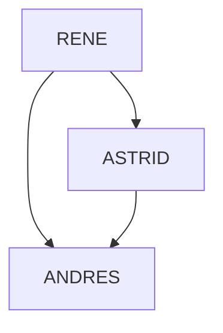

# Employees-Company-ACME

## Statement

The company ACME offers their employees the flexibility to work the hours they want. But due to some external circumstances they need to know what employees have been at the office within the same time frame

The goal of this exercise is to output a table containing pairs of employees and how often they have coincided in the office.

**Input:**
The name of an employee and the schedule they worked, indicating the time and hours. This should be a .txt file with at least five sets of data. 

**Output:**
Generate in one line for each case the name of the two employees separated by "-", followed by ": " and the number of days they can meet.

You can include the data from our examples below:

**Test Cases:**

| Input | Output |
| --- | --- |
| RENE=MO10:00-12:00,TU10:00-12:00,TH01:00-03:00,SA14:00-18:00,SU20:00-21:00<br>ASTRID=MO10:00-12:00,TH12:00-14:00,SU20:00-21:00<br>ANDRES=MO10:00-12:00,TH12:00-14:00,SU20:00-21:00 | ASTRID-RENE: 2<br>ASTRID-ANDRES: 3<br>RENE-ANDRES: 2 |

| Input | Output |
| --- | --- |
| RENE=MO10:15-12:00,TU10:00-12:00,TH13:00-13:15,SA14:00-18:00,SU20:00-21:00<br>ASTRID=MO10:00-12:00,TH12:00-14:00,SU20:00-21:00 | RENE-ASTRID: 3 |

## Structure

### Directory

```bash
.
├── data/
│   ├── case1.txt
│   └── case2.txt
├── obj/
│   ├── Day.py
│   └── Person.py
└── main.py
```

### Programming Structure

1. The first ``Day`` object contains the start and end information for an employee on a given day.
2. The second ``Person`` object contains the name and an array of size 7 with ``Day`` objects.

<p align="center">
  
</p>


## Code Explanation

The program consists of:

Read a text file with the input data, with the text file the ``Person`` object is created for each person and inside it is assigned the name of the person and an array of **size 7** with (each one of the days of the week) containing the start date and the end date initialized to -1.

To avoid saving the day of the week, the index of the ``Day`` object array found inside each ``Person`` object is used, which will later be stored ordered by means of a dictionary.

```python
days_id = {
  "MO": 0,
  "TU": 1,
  "WE": 2,
  "TH": 3,
  "FR": 4,
  "SA": 5,
  "SU": 6,
}
```

In order to compare an hour, it is considered to **normalize the hh:mm format to minutes only.**

| Original | Process | Final |
| --- | --- | --- |
| 9:50 |  | 590 minutes |

The information collected from the plain text file is segmented by certain characters or keywords (":", "=", line breaks, abbreviations, etc.) and stored in the ``Person`` object.

Finally, a comparison is made all against all (the employees), accessing each object and comparing all the days of the week one by one. 



The comparison of working times consists of:

1. Determine that the data to compare is NOT -1, it means that the employee that day is working.
2. Identify which of the two people started the working day first.
3. Difference between the end time of the person who started the workday first and the start time of the person who started the workday later, if the subtraction is positive, it means that if you can have a meeting between employees, otherwise not &space;\vee&space;(outPersonB&space;-&space;inPersonA)).

During the comparison process between people, if there is any coincidence of time, the name of the people is taken into account and a consecutive number is taken for each coincidence, to finally present it on the screen.

The complexity of this procedure is considerable is ).

<p align="center">
  
</p>

## Execution

* Download the repository from GitHub.
<p align="center">
  
</p>

* Unzip the downloaded file.
* Modify line 5 of the ``main.py`` file where the path for reading the plain text files is located.
<p align="center">
  
</p>
<p align="center">
  
</p>

* Run the command ``python main.py`` from the project location.
<p align="center">
  
</p>
